# Rap Soundtracks and Movie Performance

## Overview

As a huge fan of rap music, I’ve always been fascinated by the energy, emotion, and cultural impact it brings — not just to music, but to everything it touches. Some of the most memorable tracks I’ve ever heard came from unexpected places, like Metro Boomin’s *Spider-Man: Into the Spider-Verse* album or Post Malone’s *Sunflower*. These songs didn’t just elevate playlists — they elevated the movies themselves.

Rap is more than just a genre. It’s a movement, and when it collides with the movie industry, something powerful happens. That got me thinking: are movies with rap soundtracks more successful? Do they perform better in theaters? Do audiences rate them higher?

This project explores that intersection — music and film — by analyzing how movies featuring rap soundtracks stack up against those with other genres. From box office numbers to IMDb ratings and release strategies, I set out to uncover the story behind the beats.

---

## Data Collection

The dataset was built using a combination of methods:

- **Web Scraping**: Used BeautifulSoup to extract movie titles, gross earnings, release dates, and distributors from BoxOfficeMojo.com.
- **APIs**: Retrieved additional metadata (IMDb rating, MPAA rating, and genre info) using the OMDb and Last.fm APIs.
- **CSV Files**: Integrated supplementary Spotify data for understanding genre popularity.

To keep the analysis meaningful, I focused on high-performing movies — specifically those that grossed over $100 million. The final master DataFrame consisted of 234 movies released in the last 10 years.

---

## Understanding Rap’s Popularity in Music

Before diving into movies, I wanted to validate the influence of rap in the music world. I analyzed a Spotify dataset of 230,000+ tracks across 23 genres, using Spotify’s built-in popularity score (0–100). Rap ranked as the **second most popular genre** overall.

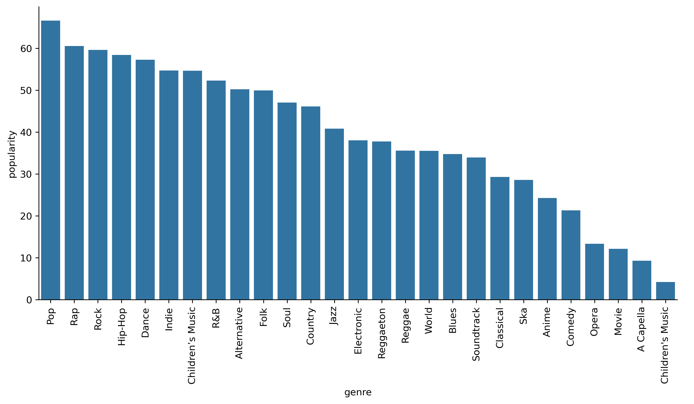

---

## Visualizations and Analysis

### Soundtrack Genre Distribution

I started by visualizing which soundtrack genres were most common across all movies.

- **Top 3**: Classical, Electronic, Instrumental.
- **Next Group**: Rap, Pop, Rock — more mainstream music genres.

These results were interesting because they show how popular music genres like rap are breaking into the traditional film score space.

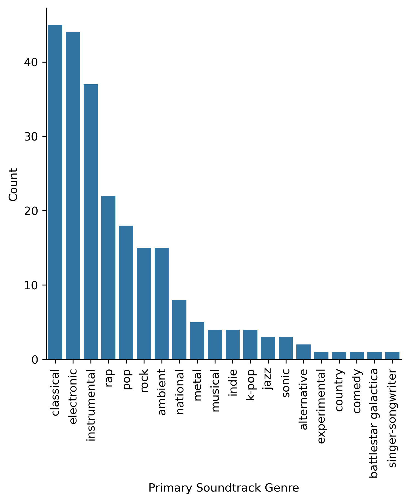

---

### Box Office Averages by Soundtrack Genre

I compared average box office earnings for the top six most common soundtrack genres. Instrumental came out on top at just over $300 million, with rap close behind at around $240 million.

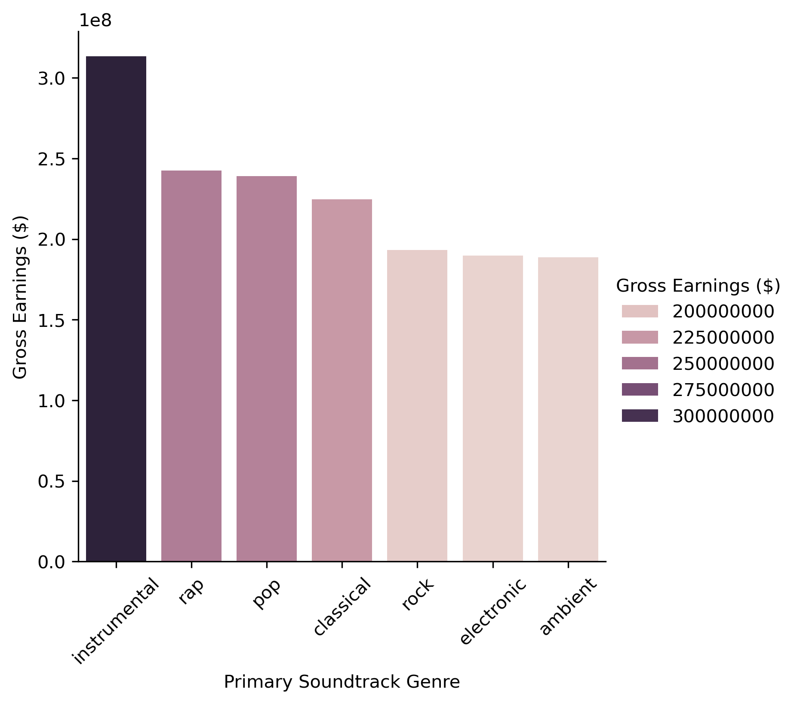

---

### IMDb Ratings by Soundtrack Genre

Next, I looked at average IMDb ratings. Instrumental was again at the top. Rap, however, ranked sixth, with an average score of 6.7.

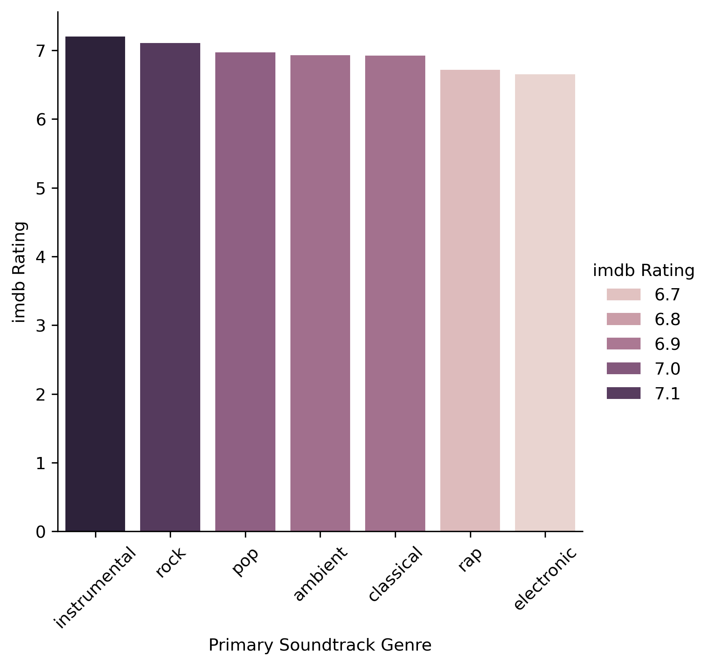
---

### Regression: Gross Earnings vs IMDb Rating

Despite its lower average IMDb score, rap soundtrack movies show a **positive correlation** between rating and revenue — suggesting that higher-rated rap films tend to perform especially well.

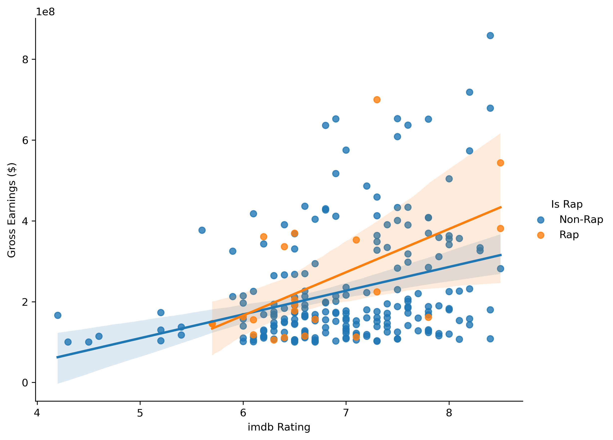

---

### MPAA Ratings Comparison

I compared MPAA ratings for rap and non-rap soundtrack films:

- **Rap Soundtracks**: PG, PG-13, R, then G.
- **Non-Rap Soundtracks**: PG-13, PG, R, then G.

It was surprising to see PG as the most common rating for movies with rap soundtracks; rap usually has a reputation for explicit content.

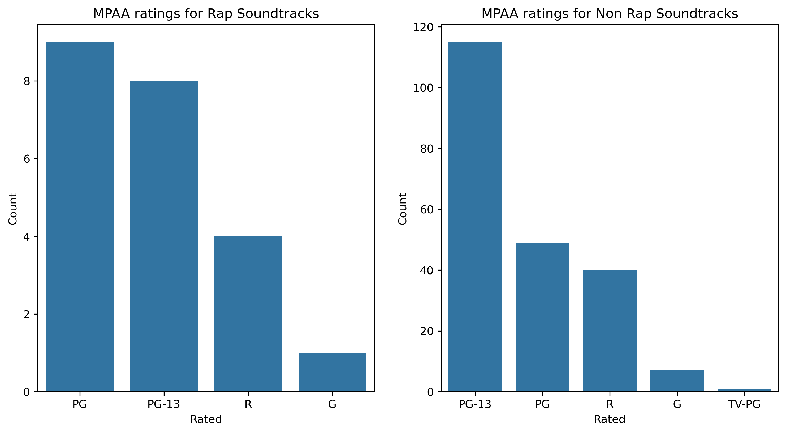

---

### Monthly Release Patterns

I analyzed the number of movie releases by month:

- **Rap Soundtrack Films**: July, February, June, May, August.
- **Non-Rap Films**: December and summer months.

This pattern suggests summer is a prime season for rap films, and February’s spike aligns with Black History Month.

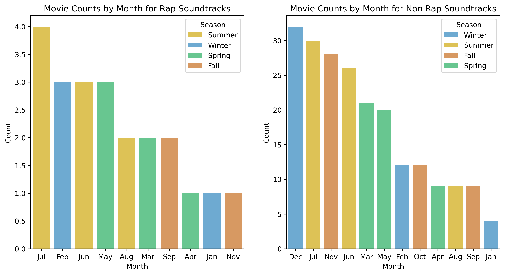

---

### Live Action vs Animated

Movies with rap soundtracks were more likely to be live action (12) than animated (10).

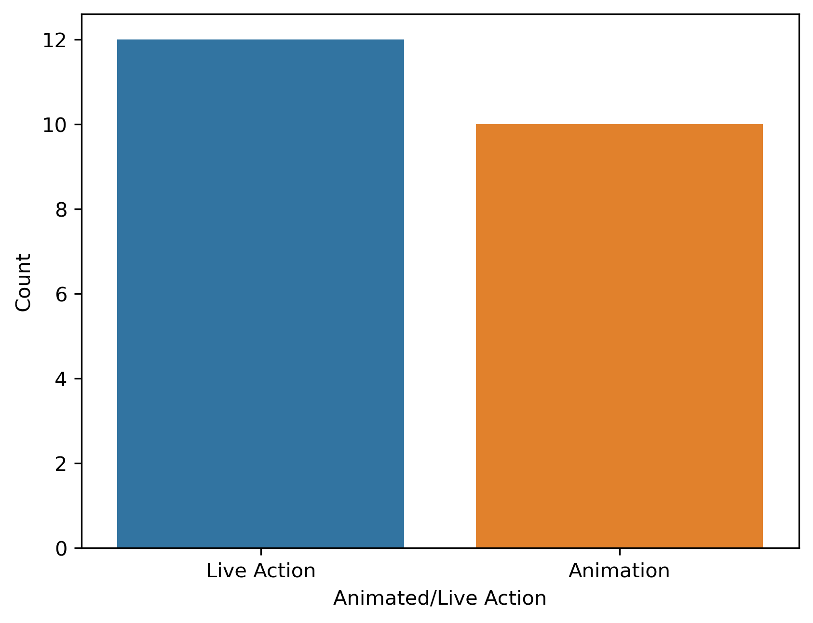

---

### Most Common Movie Genres (for Rap Soundtracks)

The top genres among rap soundtrack films were:

1. Action
2. Adventure
3. Comedy

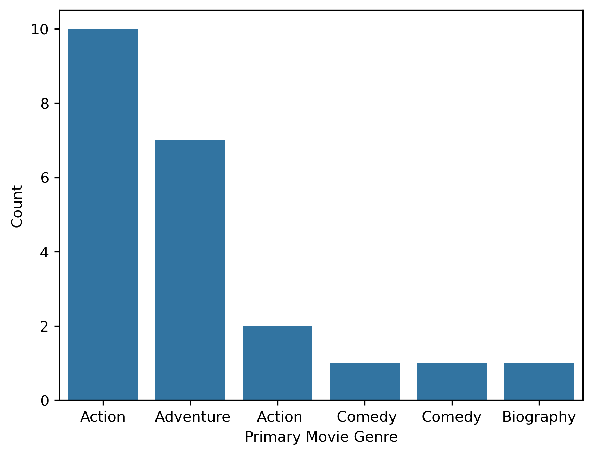

---

### Trends Over Time

I visualized trends in the six most common soundtrack genres over the last 10 years. Most genres, including rap, saw a decline around 2016–2021, followed by a recent uptick.

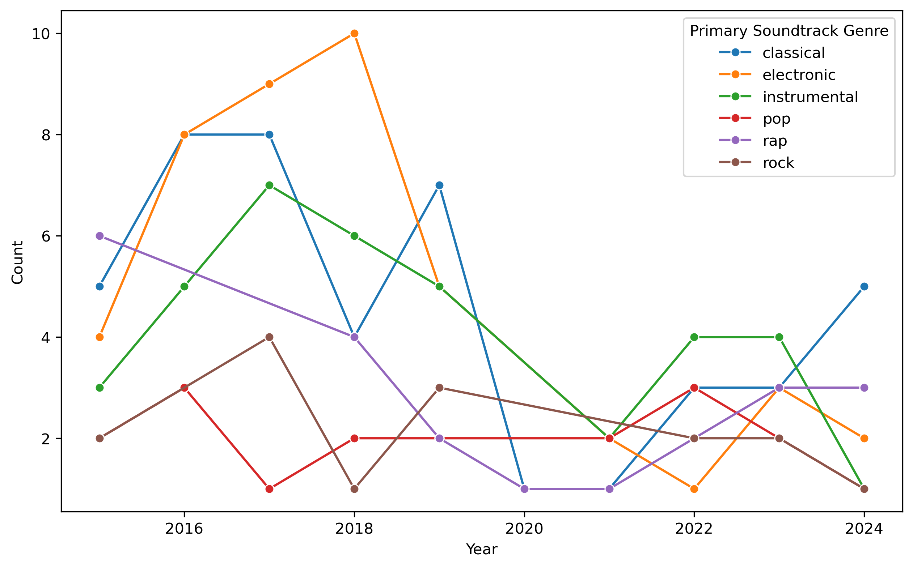

---

### Which Studios Release Rap Soundtrack Films?

Universal Pictures led the way in releasing rap soundtrack films, followed by Disney and Sony. Universal seems to have embraced rap soundtracks as a deliberate strategy.

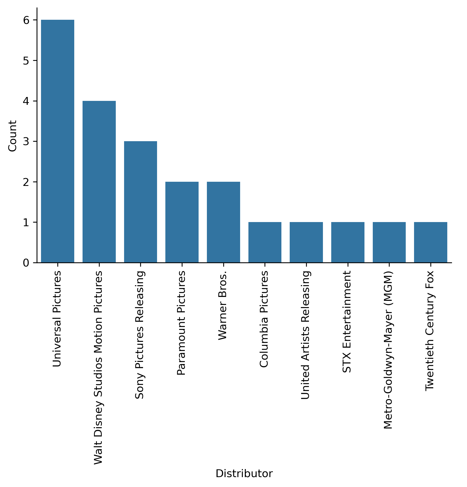

---

## Reflection and Next Steps

This project confirmed many of my hunches but also revealed some surprises. I learned:

- Rap is a powerful soundtrack genre linked to strong box office performance.
- Ratings-wise, rap films may underperform, but high-rated ones earn significantly more.
- Distribution patterns suggest strategic seasonal timing (e.g., summer, Black History Month).
- Universal Pictures has invested heavily in this trend.

### If I Had More Time...

- Expand the dataset to include movies earning under $100 million.
- Extend the range beyond 10 years for longer-term trend analysis.
- Improve soundtrack genre classification with a more robust API or scraping method.
- Incorporate production budgets, marketing data, or audience soundtrack reviews for deeper insights.

---

## Project Repository Structure

```
project-root/
│
├── data/
│   ├── movies_2013_to_2023.csv
│   ├── soundtrack_genres.csv
│   └── spotify_genre_popularity.csv
│
├── images/
│   ├── soundtrack_genre_distribution.png
│   ├── box_office_averages.png
│   ├── imdb_ratings_by_genre.png
│   ├── revenue_vs_imdb_regression.png
│   ├── mpaa_ratings_comparison.png
│   ├── release_month_distribution.png
│   ├── live_vs_animated.png
│   ├── movie_genres_for_rap.png
│   ├── soundtrack_trends_over_time.png
│   └── studio_distribution.png
│
├── notebooks/
│   ├── data_collection.ipynb
│   ├── data_cleaning.ipynb
│   └── analysis_visualizations.ipynb
│
└── rap_soundtracks_analysis.md
```

---

## Final Thoughts

This was one of the most rewarding and challenging projects I’ve taken on. As both a data analyst and a music fan, digging into this crossover between rap and film has been incredibly satisfying. There's still more to explore, but I hope this analysis helps spotlight the growing cultural and commercial influence of rap in the world of cinema.
